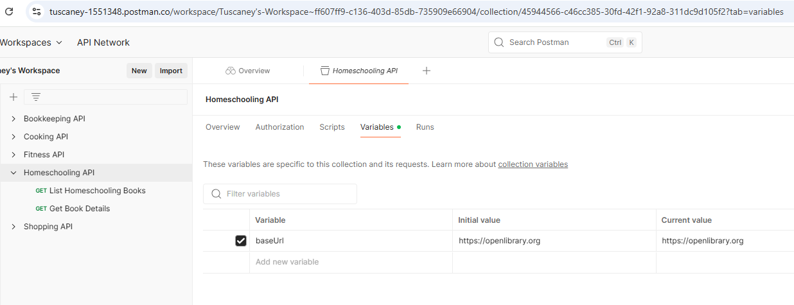

# 🏠 Homeschooling Explorer

Explore books and topics related to homeschooling using the Open Library API.

A simple, responsive web app that lets users explore homeschool-related books and curated resources. Built with semantic HTML, Tailwind CSS, and JavaScript, this project was created as a Capstone to demonstrate core front-end development skills.

---

## 📚 API Details

- **Base URL**: `https://openlibrary.org`
- **Endpoints Used**:
  - `/subjects/home_schooling.json` – returns books and metadata for the subject "Home Schooling"
  - `/works/OL45883W.json` – returns detailed metadata for a specific work

All data is fetched from the [Open Library API](https://openlibrary.org/developers/api), which is public and does not require authentication.

---

## 🔧 Purpose

This application helps users browse homeschooling books and explore helpful homeschooling websites. It demonstrates:

- API integration
- DOM manipulation
- Tailwind CSS layout
- Semantic HTML
- GitHub collaboration tools

---

## 🌐 Live Site

[🔗 Visit the Live Project](https://tuscaney.github.io/homeschooling-explorer)

---

## 📁 GitHub Repository

[🔗 View Code on GitHub](https://github.com/Tuscaney/homeschooling-explorer)

---

## 📋 GitHub Project Board

[🔗 GitHub Project Tasks](https://github.com/users/Tuscaney/projects/3)

Includes tasks for:
- Fetching and displaying books
- Styling with Tailwind
- Adding a Resources page
- Making the site responsive
- Deployment

---

## 📷 Postman Screenshot

> Screenshot showing tested endpoints `/subjects/home_schooling.json` and `/works/OL45883W.json`

---

## 🛠️ Technologies Used

- **HTML5** – semantic structure
- **Tailwind CSS** – utility-first styling
- **JavaScript** – `fetch()`, functions, DOM manipulation
- **Open Library API** – public JSON data
- **GitHub & GitHub Pages** – version control and deployment
- **Postman** – for API testing

---

## ✅ Features

- Custom JavaScript functions (`fetchAllBooks`, `showNextBook`)
- API request and response handling with error messages
- DOM manipulation using `createElement()`
- Responsive, centered layout with Tailwind classes
- Book viewer that cycles through results one at a time
- Resources page with external homeschool site links
- GitHub project board for planning and tracking progress

---

## 💡 Future Improvements

- 🔍 Add search or filtering options
- 🌙 Add dark mode toggle
- 🛒 Link each book to an online store (e.g. Amazon or Open Library)
- 💬 Add review or comments section
- 🧭 Navigation improvements (sticky nav bar or dropdown)

---

## 👩🏽‍💻 Created By

**Tuscaney Carraway**  
🎓 Front-End Web Development Capstone Project (2025)

---

